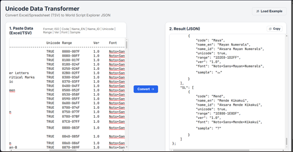

<p align="center">
  
</p>

World Script Explorer 🌍

World Script Explorer is an interactive, open-source visualization tool designed to map the world's writing systems (scripts) based on the Unicode Standard.

This project aims to help linguists, typography enthusiasts, and cultural preservationists explore the rich diversity of human writing systems through an interactive globe.

<p align="center">


🚀 Features

Interactive Map: Click on any country to see the scripts associated with it.

Unicode 17.0 Ready: Supports the latest Unicode blocks including historical and minority scripts.

Offline First: Runs entirely in the browser using local JSON data (no database server required).

Font Integration: Automatically loads Google Noto Fonts for accurate rendering of characters (no "tofu" boxes).

Open Source: Fully customizable data pipeline.


🛠️ Data Pipeline & Contribution Guide

This project relies on data from the Unicode Consortium. Since the data is massive, we use a Python Automation Script to process raw Unicode blocks into a format our web app understands.


Step 1: Get the Raw Data

<p align="center">


Download the latest Blocks.txt file from the official Unicode FTP server. This file contains the ranges for every registered writing system.

Source: Unicode 17.0.0 Blocks.txt https://www.unicode.org/Public/17.0.0/ucd/Blocks.txt (version 17 - sept 2025)

Action: Copy the entire content of the text file.
(UNICODE will updated on every sept each year)


Step 2: Process with Python (via Google Colab)

<p align="center">


We use Python to "enrich" the raw data—guessing the country of origin, assigning Google Fonts, and generating sample characters.

Recommended: Run this script in Google Colab. It's free, requires no installation, and runs directly in your browser.

Open Google Colab https://colab.google 

Create a New Notebook.

Copy and Paste the Python Script below.

Paste your raw Blocks.txt data into the raw_data variable inside the script (replace the dummy data).

Run the script (Play button).

Copy the Output (The Tab-Separated values generated at the bottom).


Step 3: Convert to JSON

The Python script outputs raw tabular data. We need to convert this into a structured JSON format for the web app.

Tool: UNICODE JSON Converter https://anggaconni.github.io/UNICODEJSONConvert/ 

<p align="center">


Action:

Go to the converter tool (or download the HTML file from the link above).

Paste the output from the Python script into the tool.

Click Convert.

Copy the resulting const GLOBAL_SCRIPT_DB = { ... } code.


Step 4: Update the App

Open index.html in this repository and replace the existing content of const GLOBAL_SCRIPT_DB with your new JSON data.


🐍 Python Automation Script

You can embed this script in your local environment or Google Colab. This script automatically maps scripts to countries (ISO codes), generates sample characters from Hex codes, and assigns the correct Noto Font.

```python
import re

# --- 1. DATA MENTAH DARI UNICODE (Blocks.txt) ---
# Paste content from https://www.unicode.org/Public/17.0.0/ucd/Blocks.txt here
# Note: Ensure you paste the FULL content of the file below.
raw_data = """
0000..007F; Basic Latin
0600..06FF; Arabic
A980..A9DF; Javanese
D800..DB7F; High Surrogates
DC00..DFFF; Low Surrogates
E000..F8FF; Private Use Area
"""

# --- 2. KAMUS PINTAR (MAPPING) ---
# FORMAT: "Keyword": "COUNTRY_CODE"
iso_mapping = {
    # --- INDONESIA & ASEAN ---
    "Latin": "ID", "Javanese": "ID", "Balinese": "ID", "Sundanese": "ID",
    "Batak": "ID", "Rejang": "ID", "Buginese": "ID", "Makasar": "ID",
    "Kawi": "ID", "Thai": "TH", "Lao": "LA", "Khmer": "KH", "Myanmar": "MM",
    "Tagalog": "PH", "Hanunoo": "PH", "Buhid": "PH", "Tagbanwa": "PH",
    "Viet": "VN", "Cham": "VN", "Kayah Li": "MM", "Pau Cin Hau": "MM",
    "Hanifi Rohingya": "MM", "Chakma": "BD", "Tai Le": "CN", "New Tai Lue": "CN",
    "Tai Tham": "TH", "Tai Viet": "VN", "Mro": "BD", "Tangsa": "IN",
    "Tai Yo": "VN", "Pahawh Hmong": "CN", "Nyiakeng Puachue Hmong": "LA"
}

trans_mapping = {
    "Script": "Aksara",
    "Sign": "Tanda",
    "Extension": "Ekstensi",
    "Basic": "Dasar",
    "Supplement": "Suplemen",
    "Unified Ideographs": "Ideograf Bersatu",
    "Private Use Area": "Area Penggunaan Pribadi",
    "Surrogates": "Surrogates (Teknis)",
    "Symbols": "Simbol",
    "Forms": "Bentuk",
    "Operators": "Operator",
    "Extended": "Perluasan"
}

print(f"{'ISO':<4}\t{'Code':<6}\t{'Name (EN)':<35}\t{'Name (ID)':<35}\t{'Unicode':<7}\t{'Range':<15}\t{'Ver':<5}\t{'Font':<25}\t{'Sample'}")
print("-" * 160)

# --- 3. AUTOMATION PROCESS ---
for line in raw_data.strip().split('\n'):
    if not line or line.startswith('#'):
        continue

    try:
        parts = line.split('; ')
        if len(parts) < 2:
            continue

        range_raw = parts[0].strip()
        name_en = parts[1].strip()

        start_hex, end_hex = range_raw.split('..')
        range_clean = f"{start_hex}-{end_hex}"
        start_int = int(start_hex, 16)

        if 0xD800 <= start_int <= 0xDFFF:
            sample_char = ""
            unicode_bool = "FALSE"
        elif 0xE000 <= start_int <= 0xF8FF:
            sample_char = ""
            unicode_bool = "FALSE"
        else:
            try:
                sample_char = chr(start_int)
                unicode_bool = "TRUE"
            except:
                sample_char = "?"
                unicode_bool = "FALSE"

        iso_code = "??"
        for key, val in iso_mapping.items():
            if key in name_en:
                iso_code = val
                break

        if "Latin" in name_en:
            script_code = "Latn"
        elif "Arabic" in name_en:
            script_code = "Arab"
        else:
            script_code = name_en[:4].title().replace(" ", "")

        font_slug = "Noto+Sans+" + name_en.replace(" ", "+")
        if "Latin" in name_en:
            font_slug = "Noto+Sans"
        if unicode_bool == "FALSE":
            font_slug = "null"

        name_id = name_en
        if "Latin" not in name_en and unicode_bool == "TRUE" and "Symbol" not in name_en:
            name_id = "Aksara " + name_id

        for en, idn in trans_mapping.items():
            name_id = name_id.replace(en, idn)

        print(f"{iso_code}\t{script_code}\t{name_en:<35}\t{name_id:<35}\t{unicode_bool}\t{range_clean}\t1.0\t{font_slug}\t{sample_char}")

    except Exception as e:
        print(f"Error on line: {line} -> {e}")
```


📜 License

This project is licensed under the MIT License - see the LICENSE file for details.

Initiated by Angga Conni Saputra.

Initiated by Angga Conni Saputra.
**Angga Conni Saputra**
*Governance Reform & Digital System Consultant*
(https://www.linkedin.com/in/anggaconni/)
