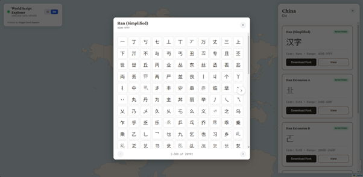
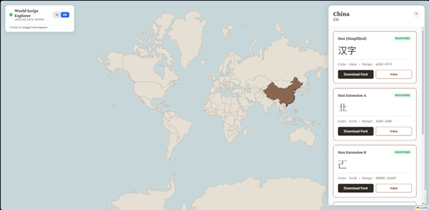
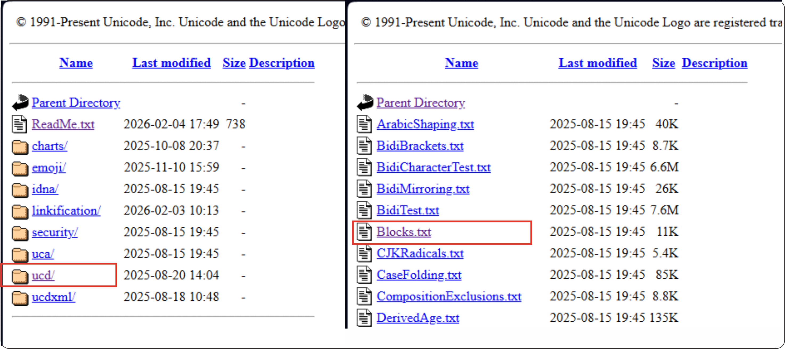
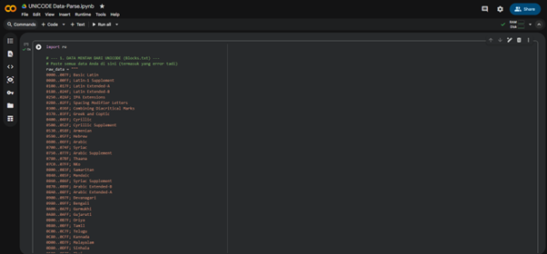

<p align="center">
  
</p>

# World Script Explorer 🌍

World Script Explorer is an interactive, open-source visualization tool designed to map the world's writing systems (scripts) based on the Unicode Standard.

This project aims to help linguists, typography enthusiasts, and cultural preservationists explore the rich diversity of human writing systems through an interactive globe.

<p align="center">


# 🚀 Features

Interactive Map: Click on any country to see the scripts associated with it.

Unicode 17.0 Ready: Supports the latest Unicode blocks including historical and minority scripts.

Offline First: Runs entirely in the browser using local JSON data (no database server required).

Font Integration: Automatically loads Google Noto Fonts for accurate rendering of characters (no "tofu" boxes).

Open Source: Fully customizable data pipeline.


# 🛠️ Data Pipeline & Contribution Guide

This project relies on data from the Unicode Consortium. Since the data is massive, we use a Python Automation Script to process raw Unicode blocks into a format our web app understands.


# Step 1: Get the Raw Data

<p align="center">


Download the latest Blocks.txt file from the official Unicode FTP server. This file contains the ranges for every registered writing system.

Source: Unicode 17.0.0 Blocks.txt https://www.unicode.org/Public/17.0.0/ucd/Blocks.txt (version 17 - sept 2025)

Action: Copy the entire content of the text file.
(UNICODE will updated on every sept each year)


# Step 2: Process with Python (via Google Colab)

<p align="center">


We use Python to "enrich" the raw data—guessing the country of origin, assigning Google Fonts, and generating sample characters.

Recommended: Run this script in Google Colab. It's free, requires no installation, and runs directly in your browser.

Open Google Colab https://colab.google 

Create a New Notebook.

Copy and Paste the Python Script below.

Paste your raw Blocks.txt data into the raw_data variable inside the script (replace the dummy data).

Run the script (Play button).

Copy the Output (The Tab-Separated values generated at the bottom).


# Step 3: Update the App

Open index.html in this repository and replace the existing content of const GLOBAL_SCRIPT_DB with your new JSON data.


🐍 Python Automation Script

You can embed this script in your local environment or Google Colab. This script automatically maps scripts to countries (ISO codes), generates sample characters from Hex codes, and assigns the correct Noto Font.

```python
import re
import json

# --- 1. DATA MENTAH DARI UNICODE 17 sept 2025 (Blocks.txt) ---
raw_data = """
0000..007F; Basic Latin
0080..00FF; Latin-1 Supplement
0100..017F; Latin Extended-A
0180..024F; Latin Extended-B
0250..02AF; IPA Extensions
02B0..02FF; Spacing Modifier Letters
0300..036F; Combining Diacritical Marks
0370..03FF; Greek and Coptic
0400..04FF; Cyrillic
0500..052F; Cyrillic Supplement
0530..058F; Armenian
0590..05FF; Hebrew
0600..06FF; Arabic
0700..074F; Syriac
0750..077F; Arabic Supplement
0780..07BF; Thaana
07C0..07FF; NKo
0800..083F; Samaritan
0840..085F; Mandaic
0860..086F; Syriac Supplement
0870..089F; Arabic Extended-B
08A0..08FF; Arabic Extended-A
0900..097F; Devanagari
0980..09FF; Bengali
0A00..0A7F; Gurmukhi
0A80..0AFF; Gujarati
0B00..0B7F; Oriya
0B80..0BFF; Tamil
0C00..0C7F; Telugu
0C80..0CFF; Kannada
0D00..0D7F; Malayalam
0D80..0DFF; Sinhala
0E00..0E7F; Thai
0E80..0EFF; Lao
0F00..0FFF; Tibetan
1000..109F; Myanmar
10A0..10FF; Georgian
1100..11FF; Hangul Jamo
1200..137F; Ethiopic
1380..139F; Ethiopic Supplement
13A0..13FF; Cherokee
1400..167F; Unified Canadian Aboriginal Syllabics
1680..169F; Ogham
16A0..16FF; Runic
1700..171F; Tagalog
1720..173F; Hanunoo
1740..175F; Buhid
1760..177F; Tagbanwa
1780..17FF; Khmer
1800..18AF; Mongolian
18B0..18FF; Unified Canadian Aboriginal Syllabics Extended
1900..194F; Limbu
1950..197F; Tai Le
1980..19DF; New Tai Lue
19E0..19FF; Khmer Symbols
1A00..1A1F; Buginese
1A20..1AAF; Tai Tham
1AB0..1AFF; Combining Diacritical Marks Extended
1B00..1B7F; Balinese
1B80..1BBF; Sundanese
1BC0..1BFF; Batak
1C00..1C4F; Lepcha
1C50..1C7F; Ol Chiki
1C80..1C8F; Cyrillic Extended-C
1C90..1CBF; Georgian Extended
1CC0..1CCF; Sundanese Supplement
1CD0..1CFF; Vedic Extensions
1D00..1D7F; Phonetic Extensions
1D80..1DBF; Phonetic Extensions Supplement
1DC0..1DFF; Combining Diacritical Marks Supplement
1E00..1EFF; Latin Extended Additional
1F00..1FFF; Greek Extended
2000..206F; General Punctuation
2070..209F; Superscripts and Subscripts
20A0..20CF; Currency Symbols
20D0..20FF; Combining Diacritical Marks for Symbols
2100..214F; Letterlike Symbols
2150..218F; Number Forms
2190..21FF; Arrows
2200..22FF; Mathematical Operators
2300..23FF; Miscellaneous Technical
2400..243F; Control Pictures
2440..245F; Optical Character Recognition
2460..24FF; Enclosed Alphanumerics
2500..257F; Box Drawing
2580..259F; Block Elements
25A0..25FF; Geometric Shapes
2600..26FF; Miscellaneous Symbols
2700..27BF; Dingbats
27C0..27EF; Miscellaneous Mathematical Symbols-A
27F0..27FF; Supplemental Arrows-A
2800..28FF; Braille Patterns
2900..297F; Supplemental Arrows-B
2980..29FF; Miscellaneous Mathematical Symbols-B
2A00..2AFF; Supplemental Mathematical Operators
2B00..2BFF; Miscellaneous Symbols and Arrows
2C00..2C5F; Glagolitic
2C60..2C7F; Latin Extended-C
2C80..2CFF; Coptic
2D00..2D2F; Georgian Supplement
2D30..2D7F; Tifinagh
2D80..2DDF; Ethiopic Extended
2DE0..2DFF; Cyrillic Extended-A
2E00..2E7F; Supplemental Punctuation
2E80..2EFF; CJK Radicals Supplement
2F00..2FDF; Kangxi Radicals
2FF0..2FFF; Ideographic Description Characters
3000..303F; CJK Symbols and Punctuation
3040..309F; Hiragana
30A0..30FF; Katakana
3100..312F; Bopomofo
3130..318F; Hangul Compatibility Jamo
3190..319F; Kanbun
31A0..31BF; Bopomofo Extended
31C0..31EF; CJK Strokes
31F0..31FF; Katakana Phonetic Extensions
3200..32FF; Enclosed CJK Letters and Months
3300..33FF; CJK Compatibility
3400..4DBF; CJK Unified Ideographs Extension A
4DC0..4DFF; Yijing Hexagram Symbols
4E00..9FFF; CJK Unified Ideographs
A000..A48F; Yi Syllables
A490..A4CF; Yi Radicals
A4D0..A4FF; Lisu
A500..A63F; Vai
A640..A69F; Cyrillic Extended-B
A6A0..A6FF; Bamum
A700..A71F; Modifier Tone Letters
A720..A7FF; Latin Extended-D
A800..A82F; Syloti Nagri
A830..A83F; Common Indic Number Forms
A840..A87F; Phags-pa
A880..A8DF; Saurashtra
A8E0..A8FF; Devanagari Extended
A900..A92F; Kayah Li
A930..A95F; Rejang
A960..A97F; Hangul Jamo Extended-A
A980..A9DF; Javanese
A9E0..A9FF; Myanmar Extended-B
AA00..AA5F; Cham
AA60..AA7F; Myanmar Extended-A
AA80..AADF; Tai Viet
AAE0..AAFF; Meetei Mayek Extensions
AB00..AB2F; Ethiopic Extended-A
AB30..AB6F; Latin Extended-E
AB70..ABBF; Cherokee Supplement
ABC0..ABFF; Meetei Mayek
AC00..D7AF; Hangul Syllables
D7B0..D7FF; Hangul Jamo Extended-B
D800..DB7F; High Surrogates
DB80..DBFF; High Private Use Surrogates
DC00..DFFF; Low Surrogates
E000..F8FF; Private Use Area
F900..FAFF; CJK Compatibility Ideographs
FB00..FB4F; Alphabetic Presentation Forms
FB50..FDFF; Arabic Presentation Forms-A
FE00..FE0F; Variation Selectors
FE10..FE1F; Vertical Forms
FE20..FE2F; Combining Half Marks
FE30..FE4F; CJK Compatibility Forms
FE50..FE6F; Small Form Variants
FE70..FEFF; Arabic Presentation Forms-B
FF00..FFEF; Halfwidth and Fullwidth Forms
FFF0..FFFF; Specials
10000..1007F; Linear B Syllabary
10080..100FF; Linear B Ideograms
10100..1013F; Aegean Numbers
10140..1018F; Ancient Greek Numbers
10190..101CF; Ancient Symbols
101D0..101FF; Phaistos Disc
10280..1029F; Lycian
102A0..102DF; Carian
102E0..102FF; Coptic Epact Numbers
10300..1032F; Old Italic
10330..1034F; Gothic
10350..1037F; Old Permic
10380..1039F; Ugaritic
103A0..103DF; Old Persian
10400..1044F; Deseret
10450..1047F; Shavian
10480..104AF; Osmanya
104B0..104FF; Osage
10500..1052F; Elbasan
10530..1056F; Caucasian Albanian
10570..105BF; Vithkuqi
105C0..105FF; Todhri
10600..1077F; Linear A
10780..107BF; Latin Extended-F
10800..1083F; Cypriot Syllabary
10840..1085F; Imperial Aramaic
10860..1087F; Palmyrene
10880..108AF; Nabataean
108E0..108FF; Hatran
10900..1091F; Phoenician
10920..1093F; Lydian
10940..1095F; Sidetic
10980..1099F; Meroitic Hieroglyphs
109A0..109FF; Meroitic Cursive
10A00..10A5F; Kharoshthi
10A60..10A7F; Old South Arabian
10A80..10A9F; Old North Arabian
10AC0..10AFF; Manichaean
10B00..10B3F; Avestan
10B40..10B5F; Inscriptional Parthian
10B60..10B7F; Inscriptional Pahlavi
10B80..10BAF; Psalter Pahlavi
10C00..10C4F; Old Turkic
10C80..10CFF; Old Hungarian
10D00..10D3F; Hanifi Rohingya
10D40..10D8F; Garay
10E60..10E7F; Rumi Numeral Symbols
10E80..10EBF; Yezidi
10EC0..10EFF; Arabic Extended-C
10F00..10F2F; Old Sogdian
10F30..10F6F; Sogdian
10F70..10FAF; Old Uyghur
10FB0..10FDF; Chorasmian
10FE0..10FFF; Elymaic
11000..1107F; Brahmi
11080..110CF; Kaithi
110D0..110FF; Sora Sompeng
11100..1114F; Chakma
11150..1117F; Mahajani
11180..111DF; Sharada
111E0..111FF; Sinhala Archaic Numbers
11200..1124F; Khojki
11280..112AF; Multani
112B0..112FF; Khudawadi
11300..1137F; Grantha
11380..113FF; Tulu-Tigalari
11400..1147F; Newa
11480..114DF; Tirhuta
11580..115FF; Siddham
11600..1165F; Modi
11660..1167F; Mongolian Supplement
11680..116CF; Takri
116D0..116FF; Myanmar Extended-C
11700..1174F; Ahom
11800..1184F; Dogra
118A0..118FF; Warang Citi
11900..1195F; Dives Akuru
119A0..119FF; Nandinagari
11A00..11A4F; Zanabazar Square
11A50..11AAF; Soyombo
11AB0..11ABF; Unified Canadian Aboriginal Syllabics Extended-A
11AC0..11AFF; Pau Cin Hau
11B00..11B5F; Devanagari Extended-A
11B60..11B7F; Sharada Supplement
11BC0..11BFF; Sunuwar
11C00..11C6F; Bhaiksuki
11C70..11CBF; Marchen
11D00..11D5F; Masaram Gondi
11D60..11DAF; Gunjala Gondi
11DB0..11DEF; Tolong Siki
11EE0..11EFF; Makasar
11F00..11F5F; Kawi
11FB0..11FBF; Lisu Supplement
11FC0..11FFF; Tamil Supplement
12000..123FF; Cuneiform
12400..1247F; Cuneiform Numbers and Punctuation
12480..1254F; Early Dynastic Cuneiform
12F90..12FFF; Cypro-Minoan
13000..1342F; Egyptian Hieroglyphs
13430..1345F; Egyptian Hieroglyph Format Controls
13460..143FF; Egyptian Hieroglyphs Extended-A
14400..1467F; Anatolian Hieroglyphs
16100..1613F; Gurung Khema
16800..16A3F; Bamum Supplement
16A40..16A6F; Mro
16A70..16ACF; Tangsa
16AD0..16AFF; Bassa Vah
16B00..16B8F; Pahawh Hmong
16D40..16D7F; Kirat Rai
16E40..16E9F; Medefaidrin
16EA0..16EDF; Beria Erfe
16F00..16F9F; Miao
16FE0..16FFF; Ideographic Symbols and Punctuation
17000..187FF; Tangut
18800..18AFF; Tangut Components
18B00..18CFF; Khitan Small Script
18D00..18D7F; Tangut Supplement
18D80..18DFF; Tangut Components Supplement
1AFF0..1AFFF; Kana Extended-B
1B000..1B0FF; Kana Supplement
1B100..1B12F; Kana Extended-A
1B130..1B16F; Small Kana Extension
1B170..1B2FF; Nushu
1BC00..1BC9F; Duployan
1BCA0..1BCAF; Shorthand Format Controls
1CC00..1CEBF; Symbols for Legacy Computing Supplement
1CEC0..1CEFF; Miscellaneous Symbols Supplement
1CF00..1CFCF; Znamenny Musical Notation
1D000..1D0FF; Byzantine Musical Symbols
1D100..1D1FF; Musical Symbols
1D200..1D24F; Ancient Greek Musical Notation
1D2C0..1D2DF; Kaktovik Numerals
1D2E0..1D2FF; Mayan Numerals
1D300..1D35F; Tai Xuan Jing Symbols
1D360..1D37F; Counting Rod Numerals
1D400..1D7FF; Mathematical Alphanumeric Symbols
1D800..1DAAF; Sutton SignWriting
1DF00..1DFFF; Latin Extended-G
1E000..1E02F; Glagolitic Supplement
1E030..1E08F; Cyrillic Extended-D
1E100..1E14F; Nyiakeng Puachue Hmong
1E290..1E2BF; Toto
1E2C0..1E2FF; Wancho
1E4D0..1E4FF; Nag Mundari
1E5D0..1E5FF; Ol Onal
1E6C0..1E6FF; Tai Yo
1E7E0..1E7FF; Ethiopic Extended-B
1E800..1E8DF; Mende Kikakui
1E900..1E95F; Adlam
1EC70..1ECBF; Indic Siyaq Numbers
1ED00..1ED4F; Ottoman Siyaq Numbers
1EE00..1EEFF; Arabic Mathematical Alphabetic Symbols
1F000..1F02F; Mahjong Tiles
1F030..1F09F; Domino Tiles
1F0A0..1F0FF; Playing Cards
1F100..1F1FF; Enclosed Alphanumeric Supplement
1F200..1F2FF; Enclosed Ideographic Supplement
1F300..1F5FF; Miscellaneous Symbols and Pictographs
1F600..1F64F; Emoticons
1F650..1F67F; Ornamental Dingbats
1F680..1F6FF; Transport and Map Symbols
1F700..1F77F; Alchemical Symbols
1F780..1F7FF; Geometric Shapes Extended
1F800..1F8FF; Supplemental Arrows-C
1F900..1F9FF; Supplemental Symbols and Pictographs
1FA00..1FA6F; Chess Symbols
1FA70..1FAFF; Symbols and Pictographs Extended-A
1FB00..1FBFF; Symbols for Legacy Computing
20000..2A6DF; CJK Unified Ideographs Extension B
2A700..2B73F; CJK Unified Ideographs Extension C
2B740..2B81F; CJK Unified Ideographs Extension D
2B820..2CEAF; CJK Unified Ideographs Extension E
2CEB0..2EBEF; CJK Unified Ideographs Extension F
2EBF0..2EE5F; CJK Unified Ideographs Extension I
2F800..2FA1F; CJK Compatibility Ideographs Supplement
30000..3134F; CJK Unified Ideographs Extension G
31350..323AF; CJK Unified Ideographs Extension H
323B0..3347F; CJK Unified Ideographs Extension J
E0000..E007F; Tags
E0100..E01EF; Variation Selectors Supplement
F0000..FFFFF; Supplementary Private Use Area-A
100000..10FFFF; Supplementary Private Use Area-B
"""

# --- 2. CONFIG: DEFINISI GRUP NEGARA (MODIFIED TO 3 LETTERS) ---
# Menambahkan UZB ke daftar pengguna Latin dan Cyrillic
LATIN_GLOBAL  = ["IDN", "USA", "GBR", "FRA", "DEU", "ITA", "ESP", "BRA", "TUR", "VNM", "PHL", "MYS", "AUS", "NZL", "SGP", "UZB"]
CYRILLIC_USER = ["RUS", "MNG", "BGR", "UKR", "KAZ", "KGZ", "TJK", "SRB", "MKD", "UZB"]
ARABIC_USER   = ["SAU", "EGY", "IRN", "PAK", "AFG", "IRQ", "SYR", "JOR", "LBN", "KWT", "OMN", "YEM", "QAT", "ARE", "BHR", "SDN", "LBY", "TUN", "DZA", "MAR"]

# --- 3. MAPPING NEGARA (3-LETTER ISO) ---
iso_mapping = {
    "Latin": LATIN_GLOBAL,
    "Cyrillic": CYRILLIC_USER,
    "Arabic": ARABIC_USER,
    "Javanese": ["IDN"], "Balinese": ["IDN"], "Sundanese": ["IDN"],
    "Batak": ["IDN"], "Rejang": ["IDN"], "Buginese": ["IDN"], "Makasar": ["IDN"],
    "Kawi": ["IDN"],
    "Thai": ["THA"], "Lao": ["LAO"], "Khmer": ["KHM"], "Myanmar": ["MMR"],
    "Tagalog": ["PHL"], "Hanunoo": ["PHL"], "Buhid": ["PHL"], "Tagbanwa": ["PHL"],
    "Viet": ["VNM"], "Cham": ["VNM", "KHM"],
    "Kayah Li": ["MMR", "THA"],
    "Tai Tham": ["THA", "LAO", "MMR"],
    "CJK": ["CHN", "TWN", "JPN", "KOR", "VNM", "SGP"],
    "Hangul": ["KOR", "PRK"],
    "Jamo": ["KOR", "PRK"],
    "Hiragana": ["JPN"], "Katakana": ["JPN"], "Kana": ["JPN"],
    "Bopomofo": ["TWN"],
    "Yi": ["CHN"], "Lisu": ["CHN"], "Nushu": ["CHN"], "Tangut": ["CHN"],
    "Mongolian": ["MNG", "CHN"], "Tibetan": ["CHN"],
    "Devanagari": ["IND", "NPL"],
    "Bengali": ["BGD", "IND"],
    "Tamil": ["IND", "LKA", "SGP", "MYS"],
    "Sinhala": ["LKA"], "Thaana": ["MDV"],
    "Gurmukhi": ["IND"], "Gujarati": ["IND"], "Oriya": ["IND"],
    "Telugu": ["IND"], "Kannada": ["IND"], "Malayalam": ["IND"],
    "Hanifi": ["MMR", "BGD"],
    "Hebrew": ["ISR"], "Syriac": ["SYR", "IRQ", "IRN", "TUR"],
    "Ethiopic": ["ETH", "ERI"],
    "Tifinagh": ["MAR", "DZA", "LBY"],
    "Cherokee": ["USA"], "Canadian": ["CAN"],
    "Greek": ["GRC", "CYP"], "Coptic": ["EGY"],
    "Georgian": ["GEO"], "Armenian": ["ARM"],
    "Symbol": ["XXX"], "Mark": ["XXX"], "Punctuation": ["XXX"],
    "Surrogates": ["XXX"], "Private Use": ["XXX"], "Variation": ["XXX"],
    "Braille": ["XXX"], "Music": ["XXX"], "Math": ["XXX"], "Forms": ["XXX"]
}

trans_mapping = {
    "Script": "Aksara", "Sign": "Tanda", "Extension": "Ekstensi",
    "Basic": "Dasar", "Supplement": "Suplemen", "Unified Ideographs": "Ideograf Bersatu",
    "Private Use Area": "Area Penggunaan Pribadi", "Surrogates": "Surrogates (Teknis)",
    "Symbols": "Simbol", "Forms": "Bentuk", "Operators": "Operator", "Extended": "Perluasan"
}

# --- 4. PROSES GENERATE JSON ---
definitions = {}
country_registry = {}

all_countries = set()
for clist in iso_mapping.values():
    all_countries.update(clist)
for c in sorted(list(all_countries)):
    country_registry[c] = []

for line in raw_data.strip().split('\n'):
    if not line: continue
    try:
        parts = line.split('; ')
        range_raw = parts[0].strip()
        name_en = parts[1].strip()

        block_id = name_en.lower().replace(" ", "_").replace("-", "_")
        start_hex, end_hex = range_raw.split('..')
        range_clean = f"{start_hex}-{end_hex}"
        start_int = int(start_hex, 16)

        # Logic Filter untuk blok non-renderable (Surrogates & Private Use Area)
        is_unicode = True
        font_slug = "Noto+Sans+" + name_en.replace(" ", "+")

        if (0xD800 <= start_int <= 0xDFFF) or (0xE000 <= start_int <= 0xF8FF) or (start_int >= 0xF0000):
            is_unicode = False
            font_slug = None
            sample_char = ""
        else:
            try: sample_char = chr(start_int)
            except:
                sample_char = ""
                is_unicode = False

        if "Latin" in name_en: font_slug = "Noto+Sans"

        # Script Code Logic
        if "Latin" in name_en: script_code = "Latn"
        elif "Arabic" in name_en: script_code = "Arab"
        elif "Cyrillic" in name_en: script_code = "Cyrl"
        elif "Han" in name_en or "Ideograph" in name_en: script_code = "Hani"
        else: script_code = name_en[:4].title().replace(" ", "")

        name_id = name_en
        if is_unicode and "Symbol" not in name_en and script_code not in ["Latn", "Arab", "Cyrl"]:
             name_id = "Aksara " + name_id
        for en, idn in trans_mapping.items():
            name_id = name_id.replace(en, idn)

        definitions[block_id] = {
            "code": script_code,
            "name_en": name_en,
            "name_id": name_id,
            "range": range_clean,
            "unicode": is_unicode,
            "font": font_slug,
            "sample": sample_char
        }

        # Logic Matching
        target_countries = []
        for keyword, country_list in iso_mapping.items():
            if keyword in name_en:
                if "Hangul" in name_en or "Jamo" in name_en:
                    filtered_list = [c for c in country_list if c in ["KOR", "PRK"]]
                    if filtered_list: target_countries.extend(filtered_list)
                elif "Hanunoo" in name_en:
                     if "PHL" in country_list: target_countries.append("PHL")
                elif "Hanifi" in name_en:
                     filtered_list = [c for c in country_list if c in ["MMR", "BGD"]]
                     target_countries.extend(filtered_list)
                else:
                    target_countries.extend(country_list)

        target_countries = sorted(list(set(target_countries)))
        if not target_countries: target_countries = ["XXX"]

        for iso in target_countries:
            if iso not in country_registry: country_registry[iso] = []
            country_registry[iso].append(block_id)

    except: pass

# --- 5. OUTPUT ---
final_db = {
    "definitions": definitions,
    "countries": country_registry
}

print("const GLOBAL_SCRIPT_DB = " + json.dumps(final_db, indent=4) + ";")
```


📜 License

This project is licensed under the MIT License - see the LICENSE file for details.


Initiated by
**Angga Conni Saputra**
*Governance Reform & Digital System Consultant*
(https://www.linkedin.com/in/anggaconni/)
